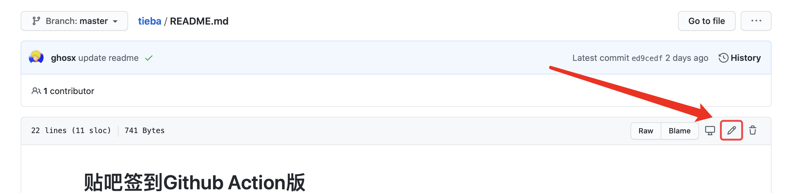
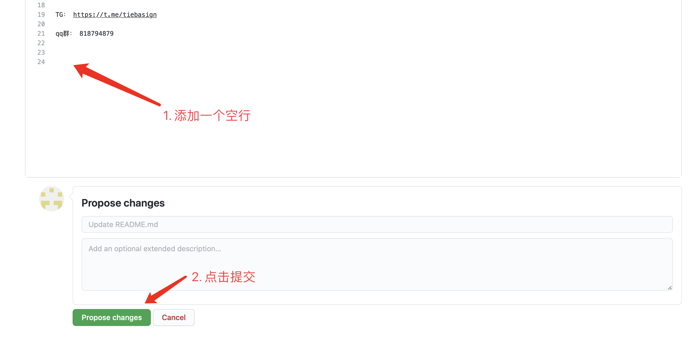
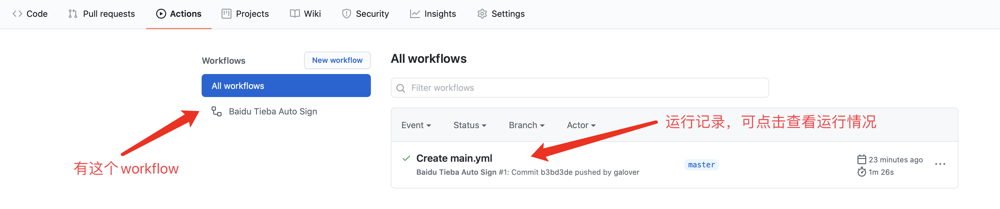

# Action Auto Sign — 京东，百度，网易云音乐自动签到


*提示：点击页面右上角 Star 标志可手动运行一次所有签到。*

<details>
  <summary><b>京东使用教程</b></summary>
1. 直接fork走
2. 再在`Settings`-`Secrets`里面添加`JD_COOKIE`
3. 多条cookie用`&`隔开，支持无数条cookie

上面三步搞定后就不用管了

刚fork完可能在Actions中看不到对应的workflow

目前已配置好自动执行时间，到了指定时间会执行，并且看到workflow

### Secrets全集合

#### `JD_COOKIE`

> 【必须】京东Cookie，必须有这个，否则全部不执行

多个账号间用&隔开，支持无数个账号签到

#### `PUSH_KEY` 

> 【可选】[server酱的微信通知](http://sc.ftqq.com/3.version)服务

用于推送Cookie失效通知，同时用于推送京东农场兑换礼物通知等

#### `BARK_PUSH`

> 【可选】BARK这个手机APP的推送 https://t.me/jdfruit/80

在settings->secrets->new secret里面Name填写BARK_PUSH，Value填写app提供的token

(注：此token是https://api.day.app/后面的内容)

#### `FruitShareCodes` 

> 【可选】京东农场分享码

```javascript
// 同一个京东账号的好友互助码用@符号隔开,不同京东账号之间按Cookie隔开方法,即用&符号隔开,下面给一个示例
// 如: 京东账号1的shareCode1@京东账号1的shareCode2&京东账号2的shareCode1@京东账号2的shareCode2
0a74407df5df4fa99672a037eec61f7e@dbb21614667246fabcfd9685b6f448f3@6fbd26cc27ac44d6a7fed34092453f77@61ff5c624949454aa88561f2cd721bf6&6fbd26cc27ac44d6a7fed34092453f77@61ff5c624949454aa88561f2cd721bf6
​```

#### `JDMarketCoinToBeans`

> 【可选】京小超蓝币换京东个数,请填入纯数字,并且在0~20之间

如果值超出范围会直接使用0,不用担心脚本无法正常执行

#### `JDJoyFeedCount`

> 【可选】宠汪汪喂食数量，请填写[10,20,40,80]其中任意一个

如果值超出范围会直接使用10,不用担心脚本无法正常执行

### Cookie获取和配置

> 具体如何取cookie如何配置,可参考 https://github.com/lxk0301/scripts/issues/8#issuecomment-675837338

```

针对京东cookie我们只需要
pt_key=****;
和
pt_pin=***;
的部分

我有两个京东账号,则我JD_COOKIE里面要填写的内容为
pt_key=****;pt_pin=***;&pt_key=****;pt_pin=***;
​```
### fork后如何同步代码 

http://www.ibloger.net/article/3361.html

</details>

<details>
  <summary><b>百度使用教程</b></summary>

1. Fork 本仓库，然后点击你的仓库右上角的 Settings，找到 Secrets 这一项，添加一个秘密环境变量。其中 `BDUSS` 存放你的 BDUSS。支持同时添加多个帐户，BDUSS 之间用 `#` 隔开即可。


2. 设置好环境变量后点击你的仓库上方的 `Actions` 选项，第一次打开需要点击 `I understand...` 按钮，确认在 Fork 的仓库上启用 GitHub Actions 。

3. 任意发起一次commit，可以参考下图流程修改readme文件。

- 打开`README.md`，点击修改按钮



- 修改任意内容，这里在末尾插入了空格。移动到最下面，点击提交。



4. 至此自动签到就搭建完毕了，可以再次点击`Actions`查看工作记录，如果有`Baidu Tieba Auto Sign`则说明workflow创建成功了。点击右侧记录可以查看详细签到情况。


</details>

<details>
  <summary><b>网易云音乐教程</b></summary>

### 一、Fork 此仓库


### 二、设置账号密码
添加名为 **USER**、**PWD** 的变量，值分别为 **账号（仅支持手机号）**、**密码 **

> Settings-->Secrets-->New secret

支持多账号，账号之间与密码之间用 ***#*** 分隔，账号与密码的个数要对应

示例：**USER:13800000000#13800000001**，**PWD:cxkjntm#jntmcxk**


### 三、启用 Action
1. 点击 ***Actions***，再点击 **I understand my workflows, go ahead and enable them**

   

2. 点击左侧的 ***Star***

   

### 四、查看运行结果
> Actions --> 签到 --> build
>
> 能看到如下图所示，表示成功


## 注意事项

1. 每天运行两次，在上午 6 点和晚上 22 点。

2. 可以通过 ***Star*** 手动启动一次。

   
</details>

<details>
  <summary><b>鸣谢</b></summary>

[网易云源码](https://github.com/t00t00-crypto/wyy-action)

[京东源码](https://github.com/sazs34/MyActions)

[百度源码](https://github.com/ghosx/tieba)
</details>

```

```